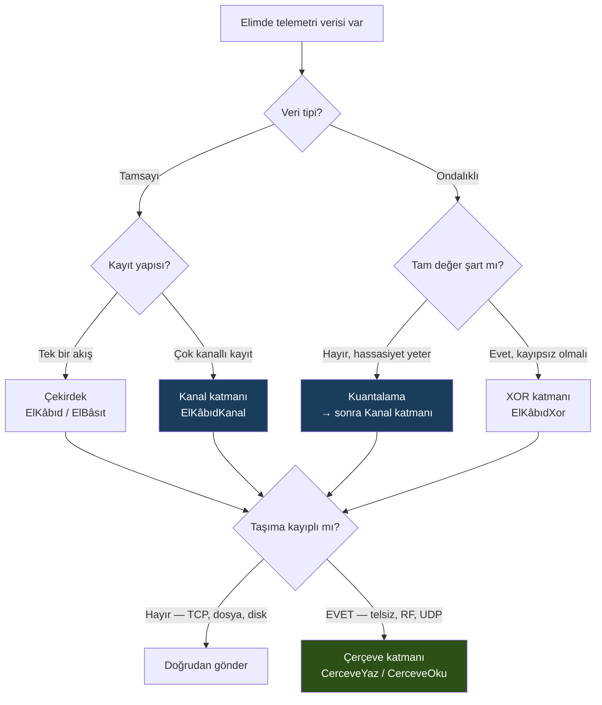
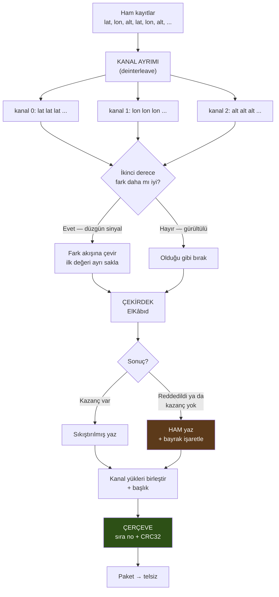
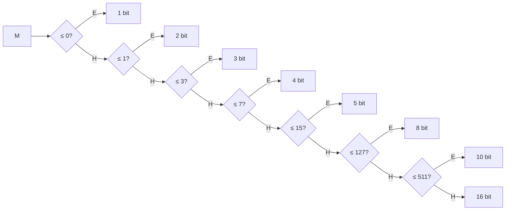
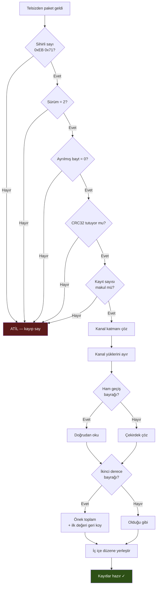
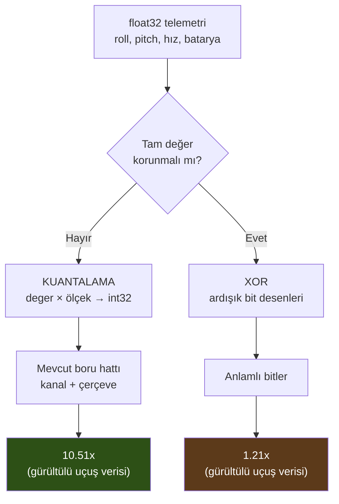

# ElBâri — Akış Şemaları

Bu belge motorun **nasıl çalıştığını** ve **hangi katmanı ne zaman kullanacağını** görsel
olarak anlatır. Bayt düzeyindeki kesin tanımlar için
[BICIM_SPESIFIKASYONU.md](BICIM_SPESIFIKASYONU.md) belgesine bakınız.

---

## 1. Hangi katmanı kullanmalıyım?

En sık sorulan soru bu. Karar ağacı:



> **Kural:** Güvenilmeyen bir kaynaktan (telsiz, ağ) veri alıyorsan **daima çerçeve
> katmanından** geçir. Bütünlük kontrolü (CRC32) yalnızca orada vardır.

---

## 2. Kodlama akışı — uçtan uca



**Ham geçiş neden var:** Bir kanal sıkıştırılamazsa veri **düşmez**, ham yazılır ve
bayrağı işaretlenir. Kayıpsızlık her koşulda korunur.

---

## 3. Kanal ayrımı neden zorunlu?

Bu, projenin en kritik tasarım kararı. Ölçülmüş sonucuyla:

```
KANAL AYRIMI YOK (naif yaklaşım)
────────────────────────────────────────────────────────────────
akış:    [400000000, 290000000, 1700000000, 400000135, ...]
             lat        lon         zaman        lat
              └──────────┴────────────┴────────────┘
                    ardışık farklar:
                    -110000000, +1410000000, -1300000000 ...
                              ↓
                    hepsi aykırı değer (|d| > 32767)
                              ↓
                    aykırı oranı %100  →  REDDEDİLDİ ✗


KANAL AYRIMI VAR
────────────────────────────────────────────────────────────────
lat  : [400000000, 400000135, 400000270, ...]   farklar: ~135  ✓
lon  : [290000000, 290000098, 290000196, ...]   farklar:  ~98  ✓
zaman: [1700000000, 1700000001, 1700000002, ...] farklar:   1  ✓
                              ↓
                    her kanal kendi içinde düzgün
                              ↓
                         5.05x  ✓
```

> Gerçek GPS verisiyle ölçüldü (24.642 kayıt): kanal ayrımı **olmadan reddediliyor**,
> **ile 5.05x**. Yani birincil hedef veri tipi ancak bu katmanla çalışıyor.

---

## 4. Çekirdek — blok kodlama

Farklar 8'erli bloklar hâlinde işlenir:

```
blok (8 fark):   +2   -1   +3   +1  +45000   -2   +1   0
                                      ↑
                              aykırı (|d| > 32767)

  1. adım — aykırı olmayanların en büyüğü:  3
  2. adım — bit genişliği seç:              3 ≤ 3  →  3 bit
  3. adım — bit akışına yaz:

     ┌────────┬──────────────┬───────────────────────┬──────────────┐
     │ etiket │ aykırı maske │  aykırı OLMAYAN       │  aykırı      │
     │ 4 bit  │    8 bit     │  farklar (7 × 3 bit)  │  (1 × 32 bit)│
     └────────┴──────────────┴───────────────────────┴──────────────┘
       mod=2     00010000        +2 -1 +3 +1 -2 +1 0     +45000
       aykırı=1
```

**Bit genişliği seçimi** (aykırı olmayan farkların en büyük mutlak değeri `M`):



Mutlak değeri **32767**'yi aşan farklar *aykırı* sayılır: bit genişliği hesabına
katılmaz, ayrıca tam 32 bit olarak yazılır.

---

## 5. Paket kaybı — çerçeveler neden var?

Motorun en ayırt edici özelliği. Sorun ve çözüm:

```
ÇERÇEVESİZ (klasik fark kodlama)
────────────────────────────────────────────────────────────────
 [ref]──►[d1]──►[d2]──►[d3]──►[d4]──►[d5]──►[d6]──►[d7]
                         ✗
                      KAYBOLDU
                         ↓
 [ref]──►[d1]──►[d2]──► ??? ─X─ ✗ ─X─ ✗ ─X─ ✗ ─X─ ✗

 Her değer bir öncekine bağlı olduğu için
 kayıptan SONRAKİ HER ŞEY çözülemez.


ÇERÇEVELİ (ElBâri)
────────────────────────────────────────────────────────────────
 ┌─ çerçeve 0 ─┐  ┌─ çerçeve 1 ─┐  ┌─ çerçeve 2 ─┐  ┌─ çerçeve 3 ─┐
 │ ref d1 d2 . │  │ ref d1 d2 . │  │ ref d1 d2 . │  │ ref d1 d2 . │
 │ sıra=0 CRC  │  │ sıra=1 CRC  │  │ sıra=2 CRC  │  │ sıra=3 CRC  │
 └─────────────┘  └─────────────┘  └─────────────┘  └─────────────┘
        ✓                ✗                ✓                ✓
                     KAYBOLDU
                        ↓
   Her çerçevenin KENDİ referansı var → zincir kırılmaz.
   Yalnızca çerçeve 1'in kayıtları kaybolur; sıra numarasından
   hangilerinin eksik olduğu da bilinir.
```

**Ölçülmüş sonuç** (gerçek GPS verisi, 100 kayıt/çerçeve):

| Paket kaybı | Çerçeveli | Çerçevesiz |
| ---: | ---: | ---: |
| %1 | **%99.2 kurtarıldı** | %0 |
| %10 | **%88.6 kurtarıldı** | %0 |
| %50 | **%45.6 kurtarıldı** | %0 |

---

## 6. Çözme akışı ve savunma katmanları



Bozuk ya da düşmanca bir paket **altı ayrı kontrolden** geçmek zorunda. Fuzz testinde
bozulmuş çerçevelerin **%100'ü** reddedildi.

---

## 7. Float yolları



**Neden kuantalama çoğu zaman doğru seçim:**

```
Gürültülü sensör verisi, float32 bit deseni:

  roll = 0.2013847   →  0011 1110 0100 1110 0011 1010 1101 0110
  roll = 0.2014102   →  0011 1110 0100 1110 0011 1100 0001 1011
                         └──── aynı ────┘  └── her örneklemde ──┘
                                              rastgele değişir

  XOR:                  0000 0000 0000 0000 0000 0110 1100 1101
                                              └─ gürültü, sıkıştırılamaz ─┘

  Kuantalama (0.001):   201, 201  →  fark 0  →  2 bit yeter
```

Gürültü mantisin alt bitlerini her örneklemde değiştirir; bu bitler **tanımı gereği**
sıkıştırılamaz. Kuantalama gürültüyü baştan atar.

> XOR yalnızca değerler **aynen tekrar ettiğinde** parlar — durağan veride **15.08x**
> ölçüldü. Bu, Gorilla'nın tasarlandığı senaryodur.

---

## 8. İki implementasyon, tek biçim

```
       C# (.NET 10)                        C (C99/C17)
    ┌────────────────┐                 ┌────────────────┐
    │  kaynak/*.cs   │                 │  c/src/*.c     │
    │  SIMD (AVX2)   │                 │  saf skaler    │
    └───────┬────────┘                 └───────┬────────┘
            │                                  │
            └──────────► AYNI BAYTLAR ◄────────┘
                              │
                    ┌─────────┴──────────┐
                    │ 27 uygunluk vektörü│
                    │ 54 kontrol, 0 hata │
                    └────────────────────┘

  Hedef platform:
    C#  →  sunucu, yer istasyonu, Linux'lu yardımcı bilgisayar
    C   →  yukarıdakilerin tümü + RTOS + bare-metal MCU + DSP
```

Gerçek GPS verisiyle (24.642 kayıt) iki sürüm **58.513 bayt birebir aynı** çıktı üretir
ve birbirinin çıktısını çözebilir.

---

**© 2025 İmran Kağan. Tüm hakları saklıdır.**
