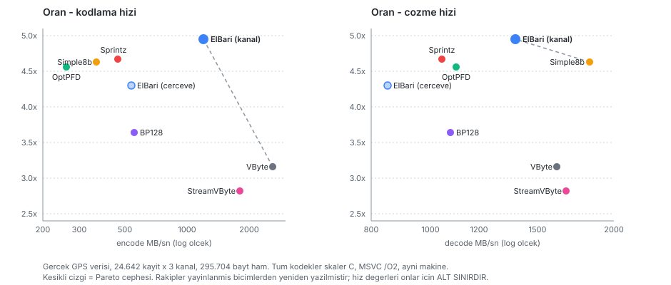

# Kıyas — ElBâri, ait olduğu tamsayı kodek ailesiyle

> Ölçüm kodu: [`c/kiyas/`](../c/kiyas/) · Metodoloji ve sınırlar:
> [`c/kiyas/BENIOKU.md`](../c/kiyas/BENIOKU.md) · Ham çıktı: `kiyas_sonuclari.csv`

## 1. Bu ölçüm neden yapıldı

ElBâri kendi belgelerinde açıkça **"yeni bir algoritma değil, PFOR-Delta ailesinin bir
uygulamasıdır"** diyor. Buna rağmen bugüne kadarki tüm karşılaştırmalar **genel amaçlı
bayt sıkıştırıcılarıyla** (zstd, LZ4, Brotli, Deflate) yapılmıştı.

Bu, karşılaştırmanın en zayıf noktasıydı. Bir kodeği kendi ailesine yerleştirip o ailenin
hiçbir üyesiyle ölçmemek, katkının büyüklüğü hakkında hiçbir şey söylemez — "zstd'yi üç
kat geçtik" cümlesi doğru rakip zstd olmadığı için anlamsızdır.

Bu belge o boşluğu kapatıyor ve **beklendiği gibi, iddiayı küçültüyor.**

## 2. Metodoloji

| | |
| --- | --- |
| Veri | §3 ana tablosu: `testverisi/gercek_gps.bin` — 24.642 gerçek GPS kaydı × 3 kanal. Ayrıca ALFA uçuş logundan altı fikstür (§3, yedi veri seti tablosu) |
| Ham boyut | 295.704 bayt (ana tablo); 164 KB – 3,2 MB (uçuş fikstürleri) |
| Ortam | Windows 11, x64, MSVC 19.51, `/std:c17 /W4 /O2` |
| Tur | 200 (her kodek için), 5 tur ısınma |
| Derleme sınıfı | **Skaler C, SIMD yok — hem ElBâri hem rakipler** |
| Doğrulama | Her kodek tam tur (round-trip) doğrulamasından geçti |

**Adil karşılaştırma için yapılanlar:**

- **Ön işleme rakiplere bedava verildi.** Kanal ayrımı + fark + zigzag, tek akış
  kodekleri için dışarıda yapılır ve **bu süre onların encode süresine dahildir.**
  ElBâri aynı işleri kendi içinde yapar.
- **Başlık yükü sayılır.** Her kodeğin kendi çerçeveleme maliyeti boyuta dahildir.
- **Boyutlar deterministik.** Üç ayrı koşuda bayt bayt aynı; hızda ~%3 oynama.
- **Rakip uygulamalar ayrıca kenar durum testinden geçti.** Oran sütunu ancak
  uygulamalar doğruysa anlamlıdır; gerçek GPS verisi kuyruk yollarını, sınır değerleri
  (0, 2³¹, 2³²−1) ve tamamen sıfır blokları tetiklemez.
  [`c/kiyas/oztest.c`](../c/kiyas/oztest.c) her kodeği 6 değer dağılımı × 24 uzunluk
  (Sprintz için ayrıca 6 kanal sayısı) ile doğrular — **toplam 1.080 durum, hepsi
  kayıpsız.**

> ### ⚠️ Hız sütununu okumadan önce
>
> Rakip kodekler **yazarlarının kütüphaneleri değildir**; yayınlanmış biçim
> tanımlarından yeniden yazılmış skaler C uygulamalarıdır.
>
> - **Oran taşınabilirdir.** Bir biçimin ürettiği bayt sayısı biçim tanımından gelir,
>   uygulama kalitesinden değil. Oran sütunu literatürle karşılaştırılabilir.
> - **Hız taşınabilir değildir.** FastPFor ve StreamVByte'ın SIMD sürümleri buradakinden
>   kat kat hızlıdır. **Hız sütunu rakipler için bir ALT SINIRDIR.**
>
> Bu yüzden aşağıda "ElBâri daha hızlı" iddiası **kurulmamıştır.** Kurulabilmesi için
> yazarların SIMD'li kütüphanelerinin bağlanması gerekir — bkz. §8.

## 3. Sonuç — kanal ayrımı ile (adil kıyas)

| Kodek | Kaynak | Bayt | Oran | bit/değer | encode MB/sn | decode MB/sn |
| --- | --- | ---: | ---: | ---: | ---: | ---: |
| **ElBâri (kanal)** | bu çalışma | **58.513** | **5.05x** | **6.33** | 1.176 | 1.673 |
| Sprintz-Delta | Blalock ve ark. 2018 | 63.321 | 4.67x | 6.85 | 463 | 1.045 |
| Simple8b | Anh & Moffat 2010 | 63.885 | 4.63x | 6.91 | 364 | 1.824 |
| OptPFD (PFOR+yama) | Zukowski 2006 / Yan 2009 | 64.807 | 4.56x | 7.01 | 260 | 1.103 |
| ElBâri (çerçeve, 100) | bu çalışma | 63.836 | 4.63x | 6.91 | 548 | 885 |
| BP128 | Lemire & Boytsov 2015 | 81.130 | 3.64x | 8.78 | 556 | 1.078 |
| VByte (LEB128) | varint temel çizgisi | 93.540 | 3.16x | 10.12 | 2.599 | 1.612 |
| StreamVByte | Lemire & Kurz 2017 | 104.855 | 2.82x | 11.35 | 1.803 | 1.671 |

Tümü tam tur doğrulamasını geçti (kayıpsız).

### Pareto sınırı

Kesikli çizgi Pareto cephesini gösterir; cephenin altında kalan her nokta, hem oran hem
hız bakımından kendisinden daha iyi bir nokta olduğu için **baskılanmıştır**.

| Eksen | Cephedeki kodekler |
| --- | --- |
| oran ↔ encode | **ElBâri (kanal)**, VByte |
| oran ↔ decode | **ElBâri (kanal)**, Simple8b |

ElBâri her iki cephede de yer alıyor — ancak yukarıdaki uyarı gereği bu, hız ekseninde
**skaler uygulamalar arasında** geçerli bir sonuçtur.

### Yedi veri setinde konum — gerçek uçuş logu

Tek veri setiyle verilen bir kıyas, veri setinin şeklini kodeğin erdemi sanma riskini
taşır. Ölçüm ALFA uçuş logundan üretilen altı fikstürle tekrarlandı
([`c/veri/`](../c/veri/), ArduPlane 3.9.0beta1, sabit kanat):

| Veri seti | K | Ham B | **ElBâri** | ElBâri enc | Ailenin en iyisi | Fark | Pareto |
| --- | ---: | ---: | ---: | ---: | --- | ---: | :---: |
| GPS (OSM referans) | 3 | 295.704 | **5,05x** | 1.176 | Sprintz 4,67x | **+%8,1** | E+D |
| GPS (ALFA uçuş) | 3 | 164.064 | **5,60x** | 1.003 | Simple8b 5,43x | **+%3,1** | E+D |
| Titreşim (VIBE) | 3 | 820.056 | 5,38x | 958 | Simple8b 5,51x | −%2,4 | E |
| Yönelim (ATT) | 3 | 820.188 | **15,58x** | 1.622 | Sprintz 15,55x | **+%0,1** | E+D |
| IMU (jiro+ivme) | 6 | 3.280.752 | 6,88x | 1.019 | Simple8b 7,43x | −%7,4 | E |
| Servo (RCOU) | 8 | 2.186.848 | **37,54x** | 2.897 | Sprintz 34,18x | **+%9,7** | E+D |
| Kumanda (RCIN) | 8 | 2.186.848 | **92,44x** | 4.037 | Sprintz 74,39x | **+%24,0** | E+D |

> Bu tablo **biçim sürümü 3** iledir. Sürüm 2'de son üç satır sırasıyla 14,70x /
> 25,64x / 40,09x idi ve ElBâri yalnızca iki veri setinde liderdi. Aradaki fark
> §3'ün sonundaki *blok-üstü sıfır koşusu* eklentisinden gelir.

*Fark = ElBâri'nin, kendisi hariç ailenin en iyi oranına göre farkı. Pareto: E = oran ↔
encode cephesinde, D = oran ↔ decode cephesinde. Encode MB/sn skaler C.*

**Okunuşu üç cümlede:**

1. **Yedi veri setinin beşinde ElBâri lider** — iki GPS seti, yönelim, servo çıkışı ve
   kumanda girişi. Beşinde de her iki Pareto cephesinde birden.
2. **IMU ve titreşimde rekabetçi ama lider değil** — %2–7 geride. Buna karşılık oran
   liderinin **2–2,4 katı encode hızıyla** çalışıyor ve encode cephesinde kalıyor.
3. **Tekrarlı PWM kanallarındaki eski açık, biçim değişikliğiyle kapandı** — nasıl
   kapandığı aşağıda.

#### RCIN bulgusu ve çözümü: biçimin sert tavanı kaldırıldı

**Bulgu (sürüm 2).** ElBâri her 8 değer için 4 bitlik bir etiket yazar; sıfır blokta veri
biti hiç yazılmaz ama **etiket yine yazılırdı.** Bu, biçime değer başına 0,5 bitlik bir
taban ve 32 bitlik değerler için **64x'lik sert bir tavan** koyuyordu — veri ne kadar
sabit olursa olsun.

RCIN'de aritmetik şöyleydi:

| | |
| --- | ---: |
| Blok sayısı (68.339 kayıt × 8 kanal ÷ 8) | 68.344 |
| Hepsi sıfır blok olsaydı | 34.204 bayt |
| **Sürüm 2'nin bu veri şeklindeki teorik tavanı** | **63,94x** |
| Sürüm 2'nin ölçülen değeri | 40,09x (54.543 bayt) |
| **Sprintz-Delta'nın ölçülen değeri** | **74,39x (29.398 bayt)** |

Sprintz, sürüm 2'nin **teorik tavanının üstüne** çıkıyordu. Sebep: Sprintz sıfır
koşularını bloklar boyunca çalıştırır (run-length), sürüm 2 ise her bloğa ayrı etiket
yazıyordu. Neredeyse sabit bir kanalda çıktının **%63'ü etiketti.**

**Çözüm (sürüm 3): blok-üstü sıfır koşusu.** Ardışık tam sıfır blokları tek bir kaçışla
kodlanıyor. Ölçüm önce yapıldı: RCIN'de blokların %94,5'i sıfır blok ve bunların %93'ü
uzun koşular hâlinde.

| | Sürüm 2 | **Sürüm 3** | Sprintz |
| --- | ---: | ---: | ---: |
| RCIN | 40,09x | **92,44x** | 74,39x |
| RCOU | 25,64x | **37,54x** | 34,18x |
| ATT | 14,70x | **15,58x** | 15,55x |
| GPS / IMU / VIBE | — | **değişmedi** | — |

Encode hızı da arttı (RCIN 2.197 → 4.037 MB/sn): koşu kaçışı blok başına iş atlıyor.

**Kaçış kodu geriye dönük güvenli.** Etiket `mod 0 + aykırı_var 1` ardından aykırı
maskesi `0x00`, sürüm 2 kodlayıcısının **üretemeyeceği** bir birleşimdir — `aykırı_var`
ancak maske sıfır değilken kurulur. Bu yüzden sürüm 3 çözücüsü bütün sürüm 2 akışlarını
aynen çözer ve **29 uygunluk vektörünün 26'sı bit bit değişmeden geçti**; değişen üçü
yalnızca çerçeve başlığındaki sürüm baytı yüzünden yeniden üretildi.

Ayrıntı: [BICIM_SPESIFIKASYONU.md §2.2b](BICIM_SPESIFIKASYONU.md)

## 4. Sonuçların dürüst okunması

**1. Katkı gerçek ama küçük: tek haneli yüzde.**

Doğru rakip ailesiyle ölçüldüğünde ElBâri'nin oran üstünlüğü şu:

| Rakip | ElBâri'nin farkı |
| --- | ---: |
| Sprintz-Delta | **+%8,2** |
| Simple8b | +%9,2 |
| OptPFD | +%10,7 |
| BP128 | +%38,6 |
| VByte | +%59,8 |

Yani zstd karşısındaki "üç kat" farkın yerini, gerçek ailede **%8'lik bir fark** aldı.
Bu, beklenen ve kabul edilmesi gereken sonuçtur: ElBâri zaten aynı fikirleri kullanıyor.
%6, kanal başına uyarlanabilir fark derecesi + genişletilmiş bit genişliği tablosu +
sıfır blok kısayolunun birlikte getirdiği kazançtır.

> **Ve bu fark veri setine bağlıdır.** Yukarıdaki yedi set tablosunda aynı fark GPS'te
> +%3…+%8, yönelimde +%0,1, tekrarlı PWM kanallarında +%10…+%24, IMU ve titreşimde ise
> −%2…−%7 çıkıyor. Tek bir veri setinden okunan bir yüzde **genellenemez**; savunulabilir
> ifade "yedi setin beşinde önde, IMU ve titreşimde geride"dir.

**2. Çerçeveleme bedelini herkes ödediğinde sıralama çerçeve boyutuna bağlı.**

> ⚠️ **Bu bulgu düzeltildi.** Önceki sürümde "çerçeveleme açılınca ElBâri oran liderliğini
> kaybediyor" yazıyordu ve dayanağı, ElBâri'nin **çerçeveli** oranını rakiplerin
> **çerçevesiz** oranıyla karşılaştırmaktı. Bu elmayla armuttur: rakiplerde çerçeveleme
> yoktur, dolayısıyla o bedeli hiç ödemezler. Senaryo 4 aynı yükü herkese verir —
> akış bağımsız çözülebilir parçalara bölünür ve her parçaya aynı 16 baytlık çerçeve
> başlığı eklenir.

**100 kayıt/çerçeve** — ElBâri **beşte beş** lider:

| Veri | **ElBâri** | Sprintz | Simple8b |
| --- | ---: | ---: | ---: |
| Kumanda (RCIN) | **33,44x** | 17,67x | 12,14x |
| Yönelim | **13,24x** | 9,04x | 8,28x |
| IMU | **6,35x** | 5,58x | 6,07x |
| Titreşim | **4,92x** | 4,47x | 4,61x |
| GPS (OSM) | **4,63x** | 3,94x | 3,83x |

Dikkat: IMU ve titreşim, **çerçevesiz kıyasta kaybettiğimiz** iki veri setidir.
Çerçeveleme herkesi vurur ama ElBâri'yi en az vurur; sıralama tersine döner.

**25 kayıt/çerçeve** — burada hâlâ Sprintz'in gerisindeyiz, ama fark küçüldü:

| Veri | ElBâri | Sprintz | Fark |
| --- | ---: | ---: | ---: |
| Servo (RCOU) | **12,56x** | 12,10x | **+%3,8** |
| Kumanda (RCIN) | 14,44x | **14,78x** | −%2,3 |
| Yönelim | 6,98x | **7,24x** | −%3,6 |
| GPS (OSM) | 3,40x | **3,55x** | −%4,2 |
| IMU | 5,11x | **5,21x** | −%1,9 |

### Buraya nasıl gelindi: çerçeve başına sabit maliyet

İlk ölçümde 25 kayıt/çerçevede açık **−%15 ile −%44** arasındaydı. Sebep ölçüldü:
8 kanallı 25 kayıtlık bir çerçevenin 68 baytının **84 baytı sabit yüktü** —
16 bayt çerçeve başlığı, `2 + 2 + kanal×4` bayt kanal başlığı ve kanal başına
32 bitlik mutlak referans.

**Biçim sürümü 4** üç adımda bunu ~20 bayta indirdi
([spesifikasyon §3.2, §3.6, §3.7, §4.1](BICIM_SPESIFIKASYONU.md)):

| Adım | Ne | Kazanç (8 kanal) | GPS 25k | RCIN 25k |
| --- | --- | ---: | ---: | ---: |
| — | başlangıç | — | 2,82x | 7,44x |
| 1 | kanal uzunluk tablosu kaldırıldı | 32 B | 3,18x | 10,60x |
| 2 | başlık alanları daraltıldı | 7 B | 3,43x | 11,68x |
| 3 | mutlak referanslar tek blokta | ~21 B | 3,40x | **14,44x** |

Üç adımın toplamı: **RCIN +%94, yönelim +%49, GPS +%21.**

GPS'te 3. adım hafif geriletti ve sebebi dürüstçe şudur: enlem/boylam/zaman
referansları birbirine **korele değil**, blok kazanmıyor ve +1 baytlık bayrak
ödeniyor. Korelasyonun olduğu her yerde kazanç kat kat büyük; adaptifliğin bedeli
bu bir bayttır.

**Kalan açık ve nedeni.** 25 kayıt/çerçevede hâlâ %2–4 geridyiz. Kalan sabit maliyet
~20 bayttır ve bunun büyük kısmı CRC32'dir (4 bayt). Sprintz'in bu ölçümde ödediği
başlık da aynı 10 bayttır, ama onun kanal içi yükü daha yalındır. Buradan sonrası
artık başlık değil, **kodlama verimliliği** meselesidir (bkz. §8).

**3. Kanal ayrımı argümanı saman adam değilmiş.**

Kanal ayrımı olmadan (iç içe geçmiş kayıt akışını tek seri gibi işleyerek):

| Kodek | Oran (kanal ayrımı yok) |
| --- | ---: |
| ElBâri (kanal) | 1,00x — **reddedildi, ham geçiş** |
| BP128 | 1,00x |
| OptPFD | 1,00x |
| Sprintz-Delta | 0,97x |
| StreamVByte | 0,94x |
| VByte | 0,86x |
| **Simple8b** | **0,50x — veriyi ikiye katlıyor** |

**Ailenin tamamı çöküyor**, ElBâri'ye özgü bir zayıflık değil. Simple8b'nin veriyi
büyütmesinin sebebi açık: iç içe geçmiş farklar 30 bitten geniş olduğu için her değer
tek başına 64 bitlik bir kelimeye düşüyor (73.926 × 8 bayt = 591.408).

Bu, README'deki "kanal katmanı olmadan reddediliyor" argümanının **rakipler için de
geçerli** olduğunu gösteriyor — dolayısıyla kanal katmanı bir savunma değil, bu problem
sınıfının zorunlu ön koşulu.

## 5. Çerçeve boyutu — "dayanıklılık ne kadara mal oluyor?"

§4'te çerçevelemenin oran liderliğini yediği görüldü. Peki 100 kayıt/çerçeve doğru
seçim mi? Çerçeve boyutu **bedava seçilen bir parametre değildir**; üç kısıt aynı anda
bağlar:

1. **Oran** — çerçeve küçüldükçe 16 baytlık başlık + CRC yükü ve kaybolan fark bağlamı
   oranı düşürür.
2. **Gecikme** — bir çerçeve **dolana kadar gönderilemez.** 10 Hz telemetride 100
   kayıtlık çerçeve, 10 saniye tamponlama demektir.
3. **Paket boyutu** — çerçeve **tek bir radyo paketine sığmalıdır.** Sığmazsa parçalanır;
   parçalardan biri düşerse çerçevenin tamamı gider ve bağımsızlık iddiası çöker.
   SiK / RFD900 sınıfı radyolarda kullanılabilir yük tipik olarak ~200-250 bayttır.

Ölçüm (gerçek GPS verisi, tümü tam tur doğrulamasını geçti):

| Çerçeve (kayıt) | Çerçeve sayısı | Toplam bayt | Oran | ort. B/çerçeve | **en büyük B** | gecikme @10 Hz | @50 Hz |
| ---: | ---: | ---: | ---: | ---: | ---: | ---: | ---: |
| *çerçeveleme yok* | — | 58.513 | **5.05x** | — | — | *akış* | *akış* |
| 1 | 24.642 | 640.692 | 0.46x | 26 | 26 | 0,10 s | 0,02 s |
| 2 | 12.321 | 374.786 | 0.79x | 30 | 38 | 0,20 s | 0,04 s |
| 5 | 4.929 | 213.425 | 1.39x | 43 | 74 | 0,50 s | 0,10 s |
| 10 | 2.465 | 132.518 | 2.23x | 54 | 88 | 1,00 s | 0,20 s |
| 20 | 1.233 | 94.843 | 3.12x | 77 | 142 | 2,00 s | 0,40 s |
| **25** | 986 | 87.090 | **3.40x** | 88 | **167** | 2,50 s | **0,50 s** |
| 50 | 493 | 71.054 | 4.16x | 144 | 297 | 5,00 s | 1,00 s |
| 100 | 247 | 63.836 | 4.63x | 258 | 554 | 10,00 s | 2,00 s |
| 200 | 124 | 60.299 | 4.90x | 486 | 983 | 20,00 s | 4,00 s |
| 500 | 50 | 59.429 | 4.98x | 1.189 | 2.321 | 50,00 s | 10,00 s |
| 1000 | 25 | 58.307 | 5.07x | 2.332 | 4.210 | 100,00 s | 20,00 s |

### Bunun anlamı — vitrin rakamı ne kadar gerçekçi?

**Sıkıştırma 5 kayıt/çerçevenin altında kayboluyor.** 1 kayıtta oran 0.46x — veri
**iki katından fazla büyüyor**, çünkü çerçeve başlığı yükten büyük.

**4.63x rakamı 10 saniyelik tamponlama gerektiriyor** (10 Hz telemetride). Canlı
telemetri için kabul edilemez: uçağın 10 saniye önceki konumunu görürsün.

**Ayrıca tek pakete sığmıyor.** 100 kayıtta en büyük çerçeve 554 bayt; tipik SiK
radyo yükünün iki katından fazla. Çerçeve parçalanmak zorunda kalırsa
*"bir paket düşerse yalnızca o çerçeve kaybolur"* garantisi zayıflar — bir çerçeve
artık birden fazla pakete yayılmıştır.

**Gerçekçi çalışma noktası çok daha küçük.** Hem tek pakete sığan (≤167 B) hem
gecikmesi kabul edilebilir (50 Hz'de 0,5 s) satır **25 kayıt/çerçeve** ve orada oran
**3.40x** — çerçevesiz 5.05x'in **%67'si**.

> Yani çerçevelemenin gerçek maliyeti, gerçekçi kısıtlar altında **%33**'tür.
>
> **Biçim sürümü 4 bu tabloyu belirgin biçimde iyileştirdi.** Sürüm 3'te aynı satır
> 2.82x idi ve maliyet %43'tü; çerçeve başına sabit yükün 84 → ~20 bayta inmesi
> farkı buradan kapattı (§3). En büyük çerçeve de 185 → 167 bayta indi.

## 6. Bu ölçüm projenin iddialarını nasıl değiştiriyor

| Eski iddia | Ölçümden sonra |
| --- | --- |
| "zstd/LZ4/Brotli'yi üç kat geçiyoruz" | Doğru ama ilgisiz — onlar doğru rakip değil |
| "En yüksek oran bizde" | **Çerçevesiz modda, yedi veri setinin beşinde.** İkisinde (IMU, titreşim) %2–7 geride. Çerçeveleme açıkken liderlik kayboluyor |
| "Hem oran hem hız lideri" | Skaler uygulamalar arasında evet; SIMD'li kütüphanelerle test edilmedi. Hız iddiası **kurulmadı** |
| "Kanal ayrımı ayırt edici özelliğimiz" | Değil — ailenin tamamı buna muhtaç |
| "Her tür telemetride çalışır" | Sürüm 2'de neredeyse sabit kanallarda 64x'lik sert tavan vardı; **sürüm 3'te kaldırıldı** (§3). Kalan zayıf nokta gürültülü çok kanallı veri (IMU, titreşim) |
| Ayırt edici özellik | **Paket kaybı dayanıklılığı** — ailede başka kimsede yok. Oran değil, bu |

## 7. Sınırlar

1. **Tek uçuş, tek platform.** Yedi veri setinin altısı **aynı** ALFA uçuşundan
   (2018-07-30 16-13-40) gelir. Platform sabit kanattır (Carbon Z T-28); yönelimi bir
   çoklu rotordan belirgin biçimde daha düzgündür, dolayısıyla ATT/IMU oranları çoklu
   rotor telemetrisine göre **iyimser** taraftadır. Farklı uçuş ve farklı platformla
   tekrarlanmalıdır.
2. **Rakipler yeniden yazıldı**, yazarlarının kütüphaneleri bağlanmadı (§2 uyarısı).
3. **Sprintz-Delta uygulandı, Sprintz-Delta-Huf değil.** Tam sürüm bit paketlemeden
   sonra Huffman katmanı çalıştırır; oranı bir miktar artırır.
4. **Sprintz'in FIRE öngörücüsü yerine düz fark kullanıldı.**
5. **Sprintz 8/16 bit için tasarlandı, 32 bite uyarlandı.** Bu bir genişletmedir.
6. **OptPFD, FastPFor'un kendisi değil**; aynı ailenin daha eski üyesi. FastPFor,
   istisna sayfalarını bit genişliğine göre gruplayarak birkaç yüzde daha iyi verir.
7. **Çerçeve süpürmesi kayıp içermiyor.** §5 oran, gecikme ve paket boyutunu ölçer;
   **paket kaybı altındaki kurtarma oranı ölçülmedi.** Optimum çerçeve boyutu ancak
   kayıp istatistiği eklendiğinde belirlenebilir.
8. **Radyo MTU'su varsayım.** ~200-250 baytlık kullanılabilir yük, SiK/RFD900 sınıfı
   için tipik değerdir; hedef donanımın gerçek MTU'su ile doğrulanmalıdır.
9. **Masaüstü x64.** Gerçek hedef olan gömülü ARM üzerinde ölçüm hâlâ yok.

## 8. Sıradaki adımlar

1. **Yazarların kütüphanelerini bağla** (FastPFor, streamvbyte, Sprintz) ve SIMD'li
   sürümlerle tekrar ölç. Hız iddiası ancak bundan sonra kurulabilir.
2. **Süpürmeye kayıp eksenini ekle.** §5 üç kısıtı ölçtü (oran, gecikme, paket boyutu);
   dördüncüsü — **patlamalı paket kaybı altında kurtarma oranı** — eksik. Gilbert-Elliott
   kanal modeliyle eklendiğinde çerçeve boyutu için gerçek bir optimum tanımlanabilir.
   Tezin merkezî katkı adayı budur.
3. ~~Blok-üstü sıfır koşusu~~ — **yapıldı** (biçim sürümü 3, §3). RCIN 40,09x → 92,44x.
3b. ~~Çerçeve başına sabit maliyet~~ — **yapıldı** (biçim sürümü 4). 84 → ~20 bayt;
   25 kayıt/çerçevede RCIN +%94.
4. **IMU ve titreşim neden geride?** Kalan iki açık burada. Her ikisi de gürültülü çok
   kanallı veri; Simple8b'nin 64 bitlik kelime paketlemesi bu profilde ElBâri'nin
   8'erli blok yapısından iyi çalışıyor. Blok boyutunun kanal başına uyarlanması
   incelenmeye değer.
5. **Farklı platform ve uçuş.** Mevcut altı fikstür aynı sabit kanat uçuşundan geliyor;
   çoklu rotor logu tabloyu belirgin biçimde değiştirebilir.
6. **Gömülü ARM üzerinde** aynı tabloyu üret.

---

*Ölçüm: [`c/kiyas/kiyas.c`](../c/kiyas/kiyas.c) · Rakip uygulamalar:
[`kodekler.c`](../c/kiyas/kodekler.c), [`sprintz.c`](../c/kiyas/sprintz.c)*
